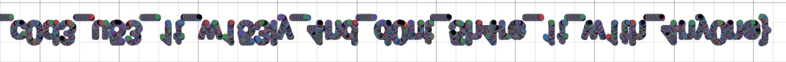

# Secret Code

We find a [zip file](_confidential.jpg.extracted/5ecr3t_c0de.zip) and a [text file](_confidential.jpg.extracted/helper.txt) embedded in [confidential.jpg](confidential.jpg)

We use zip2john and john the ripper tool to crack the password of the zip file which was **945621**.

We then get a list of random coordinates which we plotted in a graphing calculator and got the flag by mirroring its output.

>FLAG: VishwaCTF{th15_15_4_5up3r_53cr3t_c0d3_u53_1t_w153ly_4nd_d0nt_5h4re_1t_w1th_4ny0ne}
