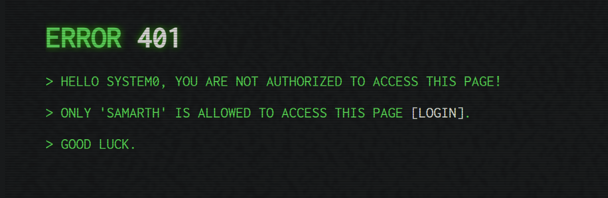

## Boot Failed

On going to /robots.txt we find /javascript/robots.js which gives us **/e8e53a51ba308caf79e4628357787f65**

/e8e53a51ba308caf79e4628357787f65 is an authentication page in whose console we get the login details **<--system0:5yc0re-->**

We login as system0 but it shows us an error

In the cookies we have a jwt token with the signing key 'winniethepooh' and using jwt.io we change the token to login as **Samarth** which redirected us to /retroshop where we can buy the ram.

We then see that our wallet only has $5 so we change the corresponding final price and hash2 values to get the flag.

>FLAG: VishwaCTF{s3r_y0u_d353rv3_t0_w1n}
